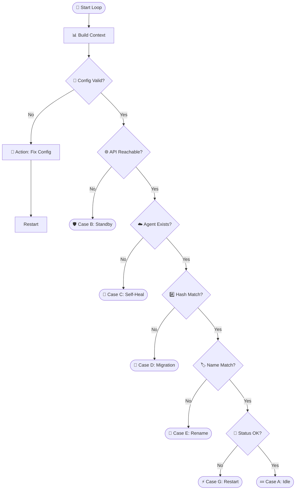

<h1 align="center">🦊 GOZUH - The Ultimate Wazuh Agent Companion</h1>

<p align="center">
  
</p>

<p align="center">
  <b>Lightweight. Secure. Persistent. Automated. Smart.</b>
</p>

**Gozuh** is a sophisticated **Wazuh Agent Companion** written in Go. It acts as an intelligent watchdog and lifecycle manager for Wazuh Agents on Windows, ensuring that identity persistence, self-healing, and disaster recovery are handled automatically based on a strict decision matrix.

---

## 🌪️ The Problem
Standard agent deployments often suffer from:
* **Identity Fragmentation:** Re-imaging creates duplicate IDs.
* **Zombie Records:** Renaming leaves "disconnected" ghost entries.
* **Stealth Failures:** Service stops or config tampering goes unnoticed.
* **Cloning Conflicts:** Cloned OS disks carry over old keys, causing collisions.

## 🛡️ The Gozuh Solution
Gozuh binds the Wazuh identity to the **Hardware**, not the OS. It uses a unique **Hardware Hash** derived from the Motherboard UUID, BIOS Serial, and Primary MAC Address.

---

## 🧠 The Brain: Logic Matrix (Truth Table)

Gozuh is engineered to handle "Day 2" operational chaos automatically by runs a continuous reconciliation loop. It compares the **Local State** against the **Server State** to determine the exact scenario and the appropriate self-healing action.

| Scenario | API Connection | Server Status | Local Status | Diagnosis | Action Taken |
| :--- | :--- | :--- | :--- | :--- | :--- |
| **[Case A: Normal](docs/case-a.md)** | ✅ Healthy | ✅ Active | ✅ Healthy | **Fully Synced** | 💤 **Idle.** (Do nothing). |
| **[Case B: Network](docs/case-b.md)** | ❌ Failed | ❓ Unknown | ✅ Healthy | **Network Outage** | 🛡️ **Standby.** Don't panic. Allow agent to buffer logs. |
| **[Case C: Ghost](docs/case-c.md)** | ✅ Healthy | ❌ 404 Not Found | ✅ Has Keys | **Server Deletion** | 🩹 **Self-Heal.** Drop local key -> Trigger Re-register. |
| **[Case D: Cloning](docs/case-d.md)** | ✅ Healthy | ✅ Hash Mismatch | ✅ Hash Changed | **Cloning Detected** | 🧬 **Migration.** Drop local identity (Protect Source) -> Fresh Register. |
| **[Case E: Rename](docs/case-e.md)** | ✅ Healthy | ✅ Name Mismatch | ⚠️ Name Changed | **Hostname Change** | 🏷️ **Update Name.** Delete old record -> Re-register with new name. |
| **[Case F: Corrupt](docs/case-f.md)** | ✅ Healthy | ✅ Active | ❌ Key/Config Bad | **Local Corruption** | 🚑 **Recovery.** Fix Config -> Restore Key from Server. |
| **[Case G: Zombie](docs/case-g.md)** | ✅ Healthy | ⚠️ Disconnected | ✅ Service Running | **Service Hang** | ⚡ **Restart.** Force restart WazuhSvc to refresh socket. |

---
**Note**: Check the details on folder `docs/`


## ⚙️ Technical Workflow

Gozuh uses a **Smart Suffix Search** to locate candidates and **Hybrid Verification** (API + Indexer Forensics) to confirm ownership of the Hardware Identity Hash.


---

## 📦 Installation & Usage

### 1. Deployment Package

Place the following in your deployment folder (e.g., for PDQ Deploy or Ansible):

* `gozuh.exe` (The compiled binary)
* `wazuh-agent-4.14.1-1.msi` (Original installer)
* `config.json` (Your server settings)

### 2. Commands

#### 🟢 Smart Install (Idempotent)

The main command for mass deployment. It only installs or repairs if the system is not healthy.

```powershell
.\gozuh.exe --install

```

#### 🟡 Local Uninstall

Removes Gozuh and the Wazuh Agent locally but **keeps** the record on the server for future recovery.

```powershell
.\gozuh.exe --uninstall

```

#### 🔴 Full Purge (Decommission)

Removes the agent locally and **permanently deletes** the agent record from the Wazuh Manager.

```powershell
.\gozuh.exe --purge

```

#### 🔵 Debug / Pre-flight

Analyzes hardware identity and server connectivity without making any changes.

```powershell
.\gozuh.exe --debug

```

---

## ⚙️ Configuration (`config.json`)

The `config.json` must reside in `C:\Program Files\GOZUH\`.

```json
{
  "wazuh_url": "https://192.168.13.230:55000",
  "api_user": "wazuh-wui",
  "api_pass": "YourSecretPassword",
  "indexer_url": "https://192.168.13.230:9200",
  "indexer_user": "admin",
  "indexer_pass": "YourIndexerPassword",
  "sync_interval": 60
}

```

---

## 🏗️ Building from Source

To build the final binary with the icon and professional metadata:

1. **Generate Resource Properties:**
```bash
cd cmd/gozuh
goversioninfo
```


3. **Compile:**
```bash
go build -ldflags="-s -w" -o gozuh.exe ./cmd/gozuh
```

---

**Developed for Modern DevSecOps Teams.**
*Gozuh ensures that your endpoint security is as persistent as your hardware.*