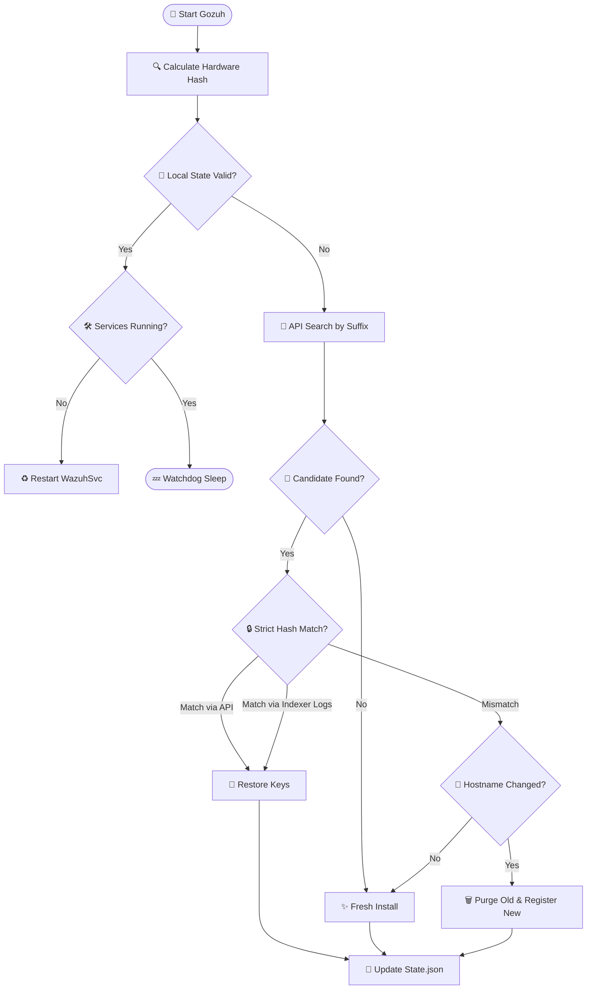

<h1 align="center">🦊 GOZUH - The Ultimate Wazuh Agent Companion</h1>

<p align="center">
  
</p>

<p align="center">
  <b>Lightweight. Secure. Persistent. Automated. Smart.</b>
</p>

**Gozuh** is a sophisticated **Wazuh Agent Companion** written in Go. It acts as an intelligent watchdog and lifecycle manager for Wazuh Agents on Windows, ensuring that identity persistence, self-healing, and disaster recovery are handled automatically.

---

## 🌪️ The Problem

Standard agent deployments often suffer from:

* **Identity Fragmentation:** Re-imaging or re-installing agents creates duplicate IDs in the manager.
* **Zombie Records:** Renaming a PC leaves "disconnected" ghost entries forever.
* **Stealth Failures:** If an agent service stops or the configuration is tampered with, the endpoint goes dark.
* **Cloning Conflicts:** Cloned OS disks often carry over old keys, causing registration collisions.

## 🛡️ The Gozuh Solution

Gozuh binds the Wazuh identity to the **Hardware**, not the OS. It uses a unique **Hardware Hash** derived from the Motherboard UUID, BIOS Serial, and Primary MAC Address to ensure the agent's identity is immutable.

---

## ⚙️ How It Works (Technical Workflow)

Gozuh uses a **Smart Suffix Search** to locate candidates and **Hybrid Verification** (API + Indexer Forensics) to confirm ownership.



---

## 🧪 Chaos Scenarios & Self-Healing

Gozuh is engineered to handle "Day 2" operational chaos automatically.

| Scenario | Behavior | Outcome |
| --- | --- | --- |
| **Fresh Install** | New hardware detected with no existing suffix on the server. | ✅ **Clean Start.** New ID created. |
| **Disaster Recovery** | OS wiped/re-installed. Agent was "Disconnected" on the server. | ✅ **Resurrection.** Gozuh queries Indexer logs, confirms hardware match, and restores old keys. |
| **Hostname Change** | User renames PC from `HRD-01` to `FINANCE-PC`. | ✅ **Auto-Migration.** Gozuh detects the name mismatch, purges the old record, and registers the new one. |
| **💾 OS Disk Cloning** | Disk cloned to new hardware. Hostname is identical, but HW Hash is different. | ✅ **Conflict Resolution.** Gozuh detects the hardware change, invalidates the old state, and registers as a new unique entity. |
| **Tampering** | User stops `WazuhSvc` or deletes `client.keys`. | ✅ **Watchdog Intervention.** Service is restarted and keys are recovered from the server automatically. |
| **Decommission** | Admin runs `--purge`. | ✅ **Total Cleanup.** Agent is removed locally and deleted permanently from the Manager database. |

---

## 📦 Installation & Usage

### 1. Deployment Package

Place the following in your deployment folder (e.g., for PDQ Deploy or Ansible):

* `gozuh.exe` (The compiled binary)
* `wazuh-agent-4.14.1-1.msi` (Original installer)
* `config.json` (Your server settings)

### 2. Commands

#### 🟢 Smart Install (Idempotent)

The main command for mass deployment. It only installs or repairs if the system is not healthy.

```powershell
.\gozuh.exe --install

```

#### 🟡 Local Uninstall

Removes Gozuh and the Wazuh Agent locally but **keeps** the record on the server for future recovery.

```powershell
.\gozuh.exe --uninstall

```

#### 🔴 Full Purge (Decommission)

Removes the agent locally and **permanently deletes** the agent record from the Wazuh Manager.

```powershell
.\gozuh.exe --purge

```

#### 🔵 Debug / Pre-flight

Analyzes hardware identity and server connectivity without making any changes.

```powershell
.\gozuh.exe --debug

```

---

## ⚙️ Configuration (`config.json`)

The `config.json` must reside in `C:\Program Files\GOZUH\`.

```json
{
  "wazuh_url": "https://192.168.13.230:55000",
  "api_user": "wazuh-wui",
  "api_pass": "YourSecretPassword",
  "indexer_url": "https://192.168.13.230:9200",
  "indexer_user": "admin",
  "indexer_pass": "YourIndexerPassword",
  "sync_interval": 60
}

```

---

## 🏗️ Building from Source

To build the final binary with the icon and professional metadata:

1. **Generate Resource Properties:**
```bash
cd cmd/gozuh
goversioninfo
```


3. **Compile:**
```bash
go build -ldflags="-s -w" -o gozuh.exe ./cmd/gozuh
```

---

**Developed for Modern DevSecOps Teams.**
*Gozuh ensures that your endpoint security is as persistent as your hardware.*