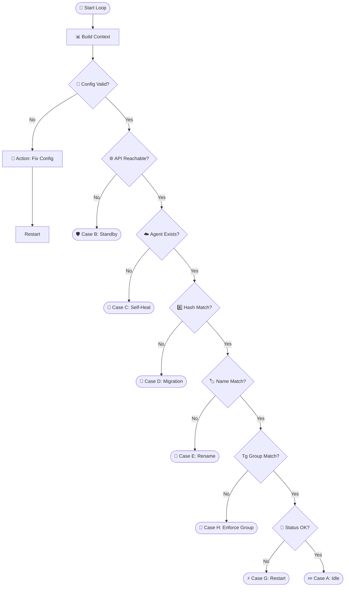

<h1 align="center">🦊 GOZUH - The Ultimate Wazuh Agent Companion</h1>

<p align="center">
  
</p>

<p align="center">
  <b>Lightweight. Secure. Persistent. Automated. Smart.</b>
</p>

**Gozuh** is a sophisticated **Wazuh Agent Companion** written in Go. It acts as an intelligent watchdog and lifecycle manager for Wazuh Agents on Windows, ensuring that identity persistence, self-healing, configuration enforcement, and disaster recovery are handled automatically based on a strict decision matrix.

---

## 🌪️ The Problem
Standard agent deployments often suffer from:
* **Identity Fragmentation:** Re-imaging creates duplicate IDs.
* **Zombie Records:** Renaming leaves "disconnected" ghost entries.
* **Config Drift:** Agents moved to different departments (Groups) don't update on the server.
* **Stealth Failures:** Service stops or config tampering goes unnoticed.
* **Cloning Conflicts:** Cloned OS disks carry over old keys, causing collisions.

## 🛡️ The Gozuh Solution
Gozuh binds the Wazuh identity to the **Hardware**, not the OS. It uses a unique **Hardware Hash** derived from the Motherboard UUID, BIOS Serial, and Primary MAC Address.

It enforces **Infrastructure as Code (IaC)** principles at the endpoint level: **The Local Configuration is the Single Source of Truth.**

---

## 🧠 The Brain: Logic Matrix (Truth Table)

Gozuh runs a continuous reconciliation loop (Watchdog). It compares the **Local State** (`config.json` + Hardware) against the **Server State** (API) to determine the exact scenario.

| Scenario | API Connection | Server Status | Local Status | Diagnosis | Action Taken |
| :--- | :--- | :--- | :--- | :--- | :--- |
| **[Case A: Normal](docs/case-a.md)** | ✅ Healthy | ✅ Active | ✅ Healthy | **Fully Synced** | 💤 **Idle.** (Do nothing). |
| **[Case B: Network](docs/case-b.md)** | ❌ Failed | ❓ Unknown | ✅ Healthy | **Network Outage** | 🛡️ **Standby.** Don't panic. Allow agent to buffer logs. |
| **[Case C: Ghost](docs/case-c.md)** | ✅ Healthy | ❌ 404 Not Found | ✅ Has Keys | **Server Deletion** | 🩹 **Self-Heal.** Drop local key -> Trigger Re-register. |
| **[Case D: Cloning](docs/case-d.md)** | ✅ Healthy | ✅ Hash Mismatch | ✅ Hash Changed | **Cloning Detected** | 🧬 **Migration.** Drop local identity (Protect Source) -> Fresh Register. |
| **[Case E: Rename](docs/case-e.md)** | ✅ Healthy | ✅ Name Mismatch | ⚠️ Name Changed | **Hostname Change** | 🏷️ **Update Name.** Delete old record -> Re-register with new name. |
| **[Case F: Corrupt](docs/case-f.md)** | ✅ Healthy | ✅ Active | ❌ Key/Config Bad | **Local Corruption** | 🚑 **Recovery.** Fix Config -> Restore Key from Server. |
| **[Case G: Zombie](docs/case-g.md)** | ✅ Healthy | ⚠️ Disconnected | ✅ Service Running | **Service Hang** | ⚡ **Restart.** Force restart WazuhSvc to refresh socket. |
| **[Case H: Drift](docs/case-h.md)** | ✅ Healthy | ✅ Group Mismatch | ✅ Group Changed | **Config Drift** | 👮 **Enforce Group.** Delete old record -> Register to new Group. |

---

## ⚙️ Technical Workflow

Gozuh uses a **Smart Suffix Search** to locate candidates and **Hybrid Verification** (API + Indexer Forensics) to confirm ownership of the Hardware Identity Hash.



---

## 📦 Installation & Usage

Gozuh separates configuration from installation for better automation.

### 1. Configuration Mode (`--configure`)

Sets up the encrypted `config.json`. This is idempotent (safe to run multiple times).

```powershell
# Basic Setup
.\gozuh.exe --configure `
  --mgr-url "[https://192.168.1.100](https://192.168.1.100)" `
  --mgr-user "admin" --mgr-pass "SecretPassword" `
  --group "Production"

# Enable Virtual Machine NIC Support (Hyper-V/VMware)
.\gozuh.exe --configure --allow-virtual

```

### 2. Installation Mode (`--install`)

Downloads (if needed), installs the MSI, registers the agent, and hardens the config.

**Requirement:** You must provide the MSI filename using `--name`.

```powershell
# Scenario A: Local File Exists
.\gozuh.exe --install --name "wazuh-agent-4.14.1.msi"

# Scenario B: Download from URL (Auto-download if missing)
.\gozuh.exe --install --group default --name wazuh-agent-4.14.1-1.msi `
  --installer "https://packages.wazuh.com/4.x/windows/wazuh-agent-4.14.1-1.msi" `
  --mgr-url https://192.168.0.230:55000 --mgr-user wazuh-wui --mgr-pass "MyS3cr37P450r.*-" `
  --idx-url https://192.168.0.230:9200 --idx-user admin --idx-pass "SecretPassword"

```

### 3. Utility Commands

| Command | Description |
| --- | --- |
| `--debug` | Display Hardware Identity (UUID, Serial, MAC Hash) & Connectivity Status. |
| `--stop` | Stop Gozuh & Wazuh services safely. |
| `--restart` | Restart services (Triggers immediate reconciliation). |
| `--uninstall` | Remove Gozuh Service & Uninstall Agent (Keeps `config.json`). |
| `--purge` | **Full Wipe.** Decommission agent from Server & Uninstall locally. |

---

## ⚙️ Configuration (`config.json`)

The configuration file is stored in `C:\Program Files\GOZUH\config.json`. Passwords are stored using **AES Encryption**.

```json
{
  "manager_url": "[https://192.168.0.230:55000](https://192.168.0.230:55000)",
  "manager_user": "wazuh-wui",
  "manager_pass": "U2FsdGVkX1+...",
  "indexer_url": "[https://192.168.0.230:9200](https://192.168.0.230:9200)",
  "indexer_user": "admin",
  "indexer_pass": "U2FsdGVkX1+...",
  "agent_group": "default",
  "installer_name": "wazuh-agent-4.14.1-1.msi",
  "disable_cis": true,
  "allow_virtual": false,
  "sync_interval": 60
}

```

### Features Highlight

* **Virtual NIC Support:** Use `--allow-virtual` (or set in config) to support VMs. By default, Gozuh ignores virtual adapters to prevent identity spoofing.
* **Log Rotation:** `service.log` is automatically rotated and cleaned (keeps last 3 days) on service startup to save disk space.
* **Smart Download:** The installer is only downloaded if it doesn't exist locally in the Gozuh directory.

---

## 🏗️ Building from Source

To build the final binary with embedded encryption keys and metadata:

1. **Generate Resource Properties (Icon/Version):**
```bash
cd cmd/gozuh
goversioninfo

```


2. **Compile with Key Injection:**
*Replace `SUPER_SECRET_KEY...` with your own 32-byte key for AES encryption.*
```bash
go build -ldflags="-X 'gozuh/internal/config.EncryptionKey=SUPER_SECRET_KEY_123456789012' -s -w" -o gozuh.exe ./cmd/gozuh

```


---

**Developed for Modern DevSecOps Teams.**
*Gozuh ensures that your endpoint security is as persistent as your hardware.*
