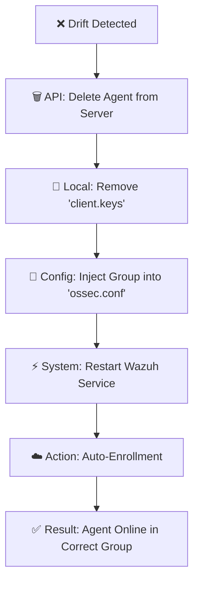

# 👮 Case H: Group Mismatch (Configuration Drift)

**Diagnosis:** The Agent is healthy, connected, and verified (Hardware Hash matches), but its **Group assignment** on the Server does not match the local configuration.

**Philosophy:** Gozuh treats the local `config.json` as the **Single Source of Truth (SSOT)**. Any deviation on the server side is considered "Configuration Drift" and must be corrected immediately.

---

## 🔍 Trigger Conditions

This scenario triggers when the **Logic Matrix** confirms:
1.  ✅ **API Connection:** Reachable.
2.  ✅ **Identity:** Hardware Hash matches the server record.
3.  ✅ **Hostname:** Matches.
4.  ❌ **Group Drift:** The group defined in `config.json` differs from the group returned by the Wazuh API.

### Common Scenarios
* **Asset Movement:** An administrator changes `config.json` from `"default"` to `"IT-Dept"` via Ansible/SCCM, but the server still lists it as `"default"`.
* **Manual Tampering:** Someone manually changed the agent's group on the Wazuh Dashboard, conflicting with the desired state in `config.json`.

---

## 🛠️ The Resolution Workflow

Since Wazuh Groups are deeply tied to the agent's registration key and configuration, Gozuh resolves this by **Destroying** the incorrect relationship and **Re-creating** a correct one.

